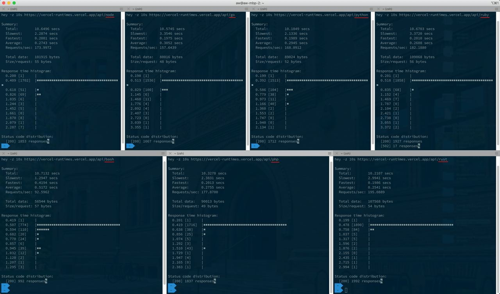

# Vercel Runtimes

This repo contains code example for different vercel runtimes. Go to the [api directory](https://github.com/wzulfikar/vercel-runtimes/tree/main/api) to see the codes.

_Check the demo!_

🌐 https://vercel-runtimes.vercel.app

### Official Runtimes

- **Node:** https://vercel-runtimes.vercel.app/api/node  
  Sample output:
  ```
  JS says hello world! Time is 2020-12-13T11:17:22.185Z
  ```
- **Go:** https://vercel-runtimes.vercel.app/api/go  
  Sample output:
  ```
  Go says hello world! Time is 2020-12-13T11:17:22.185Z
  ```
- **Python:** https://vercel-runtimes.vercel.app/api/python  
  Sample output:
  ```
  Python says hello world! Time is 2020-12-13T11:17:22.185Z
  ```
- **Ruby:** https://vercel-runtimes.vercel.app/api/ruby  
  Sample output:

  ```
  Ruby says hello world! Time is 2020-12-13T11:17:22.185Z
  ```

### Community Runtimes

- **Bash:** https://vercel-runtimes.vercel.app/api/bash  
  Sample output:

  ```
  Bash says hello world! Time is 2020-12-13 13:01:07 +0200
  ```

- **PHP:** https://vercel-runtimes.vercel.app/api/php  
  Sample output:
  ```
  PHP says hello world! Time is 2020-12-13T11:17:22.185Z
  ```
- **Deno:** https://vercel-runtimes.vercel.app/api/deno  
  Sample output:
  ```
  Deno says hello world! Time is 2020-12-13T11:17:22.185Z
  ```
- **Rust:** https://vercel-runtimes.vercel.app/api/rust  
  Sample output:

  ```
  Rust says hello world! Time is 2020-12-13T11:17:22.185Z
  ```

---

P.S:

- hey test: 
- Vercel documentation: https://vercel.com/docs/runtimes
